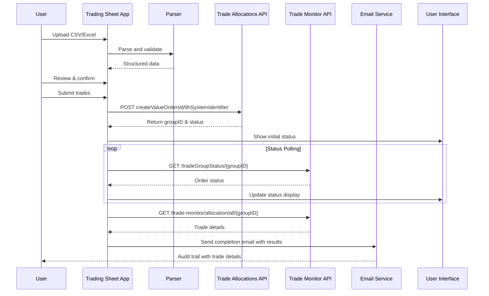

# Trade Allocations API Integration Blueprint

## Executive Summary

This document provides a comprehensive implementation blueprint for integrating the EasyEquities Trade Allocations Monitor API into the Trading Sheet Upload application. The integration will enable direct trade execution through API calls, replacing manual processing while maintaining audit trails and enhancing user feedback.

## 1. Architecture Overview

### 1.1 Integration Flow


### 1.2 System Components

#### New Components to Implement
1. **Trade API Client** (`app/api/trade_client.py`)
2. **API Data Mapper** (`app/api/trade_mapper.py`)
3. **Status Monitor Service** (`app/api/status_monitor.py`)
4. **UI Status Component** (`app/components/trade_status.py`)

#### Modified Components
1. **Trading Sheet Parser** - Enhanced CSV mapping
2. **Email Sender** - Include trade execution results
3. **Submit Page** - Add API status display

## 2. API Integration Specifications

### 2.1 Environment Configuration

```python
# .streamlit/secrets.toml
[trade_api]
# Environment URLs
uat_base_url = "https://tradeallocationsapi.purple-uat.easyequities.io"
qa_base_url = "https://tradeallocationsapi.purple-qa.easyequities.io"
prod_base_url = "https://tradeallocationsapi.easyequities.io"  # Production URL

# Monitor URLs
uat_monitor_url = "https://trade-allocations-monitor.purple-uat.easyequities.io"
qa_monitor_url = "https://trade-allocations-monitor.purple-qa.easyequities.io"
prod_monitor_url = "https://trade-allocations-monitor.easyequities.io"

# Configuration
environment = "uat"  # Options: uat, qa, prod
system_identifier_id = 27
api_timeout = 30
max_retry_attempts = 3
status_polling_interval = 5  # seconds
max_polling_duration = 300  # 5 minutes

# Authentication (if required)
api_key = "your-api-key-here"
api_secret = "your-api-secret-here"
```

### 2.2 CSV to API Mapping

#### CSV Format (from docs/CSV_Upload_Convention.csv)
```csv
ShareCode,ContractCode,InstrumentID,Units,Amount,Direction,UserID,TrustAccount
NGWINT,UT.ZA.NGWINT,4257,123.12345679,1000.12,BUY,807686,123456
```

#### API Payload Mapping
```python
def map_csv_to_api_payload(csv_data: pd.DataFrame, metadata: Dict) -> Dict:
    """
    Maps CSV data to Trade Allocations API payload format.
    """
    import uuid
    from datetime import datetime
    
    # Generate unique group ID for batch
    group_id = str(uuid.uuid4()).upper()
    
    # Map Direction to trustAccountActionId
    action_mapping = {
        'BUY': 7,   # Purchase action
        'SELL': 8   # Redemption action
    }
    
    # Process each trade row
    trade_allocations = []
    for _, row in csv_data.iterrows():
        trade_request = {
            "userID": int(row['UserID']),
            "instrumentID": int(row['InstrumentID']),
            "trustAccountID": int(row['TrustAccount']),
            "depositRequired": False,
            "costCalculationType": 1,  # Value-based calculation
            "uniqueTransactionReference": f"TSA_{group_id[:8]}_{row.name}",
            "dateCreated": datetime.now().strftime("%Y-%m-%d %H:%M"),
            "triggerOnDate": datetime.now().strftime("%Y-%m-%d %H:%M"),
            "trustAccountActionId": action_mapping[row['Direction']],
            "transactionTag": f"{row['ShareCode']}_{row['Direction']}",
            "startAllocationProcessManually": False,
            "isCashMovement": False,
            "allowNegativeMovement": False,
            "traderID": metadata.get('trader_id', 45314),  # From session
            "totalTradeRequestsInGroup": len(csv_data),
            "systemIdentifierID": 27,  # Your app's identifier
            "amount": float(row['Amount']),
            "units": 0  # For value orders, units = 0
        }
        trade_allocations.append(trade_request)
    
    return {
        "systemIdentifierID": 27,
        "groupId": group_id,  # Include for tracking
        "valueTradeAllocationRequestDTOS": trade_allocations
    }
```

## 3. Implementation Components

### 3.1 Trade API Client (`app/api/trade_client.py`)

```python
"""
Trade Allocations API client for executing trades.
"""

import requests
import streamlit as st
from typing import Dict, Any, Optional, List
from datetime import datetime
import time
import json

class TradeAllocationsClient:
    """Client for interacting with Trade Allocations API."""
    
    def __init__(self):
        """Initialize client with configuration from secrets."""
        self.config = st.secrets["trade_api"]
        self.environment = self.config.get("environment", "uat")
        self.base_url = self.config[f"{self.environment}_base_url"]
        self.monitor_url = self.config[f"{self.environment}_monitor_url"]
        self.system_id = self.config["system_identifier_id"]
        self.timeout = self.config.get("api_timeout", 30)
        self.session = requests.Session()
        
        # Set authentication headers if provided
        if "api_key" in self.config:
            self.session.headers.update({
                "Authorization": f"Bearer {self.config['api_key']}",
                "Content-Type": "application/json",
                "Accept": "application/json"
            })
        else:
            self.session.headers.update({
                "Content-Type": "application/json",
                "Accept": "*/*"
            })
    
    def create_value_orders(self, payload: Dict[str, Any]) -> Dict[str, Any]:
        """
        Submit value orders to the Trade Allocations API.
        
        Args:
            payload: API payload containing trade requests
            
        Returns:
            API response with groupId and status
        """
        endpoint = f"{self.base_url}/tradeallocations/monitored/order/createValueOrdersWithSystemIdentifier"
        
        try:
            response = self.session.post(
                endpoint,
                json=payload,
                timeout=self.timeout
            )
            response.raise_for_status()
            
            result = response.json() if response.text else {}
            
            # Extract group ID from response or use the one we sent
            group_id = result.get('groupId') or payload.get('groupId')
            
            return {
                'success': True,
                'groupId': group_id,
                'response': result,
                'message': 'Orders submitted successfully'
            }
            
        except requests.exceptions.Timeout:
            return {
                'success': False,
                'error': 'Request timeout',
                'message': 'The API request timed out. Please try again.'
            }
        except requests.exceptions.RequestException as e:
            return {
                'success': False,
                'error': str(e),
                'message': f'API request failed: {str(e)}'
            }
        except Exception as e:
            return {
                'success': False,
                'error': str(e),
                'message': f'Unexpected error: {str(e)}'
            }
    
    def get_group_status(self, group_id: str) -> Dict[str, Any]:
        """
        Query the status of a trade group.
        
        Args:
            group_id: The group identifier from order creation
            
        Returns:
            Status information for the trade group
        """
        endpoint = f"{self.monitor_url}/tradeGroupStatus/{group_id}"
        
        try:
            response = self.session.get(endpoint, timeout=self.timeout)
            response.raise_for_status()
            
            data = response.json() if response.text else {}
            
            return {
                'success': True,
                'status': data.get('status', 'UNKNOWN'),
                'data': data,
                'message': data.get('message', 'Status retrieved successfully')
            }
            
        except requests.exceptions.RequestException as e:
            return {
                'success': False,
                'error': str(e),
                'status': 'ERROR',
                'message': f'Failed to get status: {str(e)}'
            }
    
    def get_all_trade_allocations(self, group_id: str) -> Dict[str, Any]:
        """
        Get detailed information for all trades in a group.
        
        Args:
            group_id: The group identifier
            
        Returns:
            Detailed trade allocation information
        """
        endpoint = f"{self.monitor_url}/trade-monitor/allocation/all/{group_id}"
        
        try:
            response = self.session.get(endpoint, timeout=self.timeout)
            response.raise_for_status()
            
            data = response.json() if response.text else []
            
            return {
                'success': True,
                'allocations': data,
                'count': len(data) if isinstance(data, list) else 0,
                'message': 'Trade allocations retrieved successfully'
            }
            
        except requests.exceptions.RequestException as e:
            return {
                'success': False,
                'error': str(e),
                'allocations': [],
                'message': f'Failed to get allocations: {str(e)}'
            }
    
    def poll_status(self, group_id: str, callback=None) -> Dict[str, Any]:
        """
        Poll for trade group status until completion or timeout.
        
        Args:
            group_id: The group identifier
            callback: Optional callback function for status updates
            
        Returns:
            Final status information
        """
        max_duration = self.config.get("max_polling_duration", 300)
        interval = self.config.get("status_polling_interval", 5)
        start_time = time.time()
        
        while time.time() - start_time < max_duration:
            status_result = self.get_group_status(group_id)
            
            if callback:
                callback(status_result)
            
            # Check for terminal states
            status = status_result.get('status', '').upper()
            if status in ['COMPLETED', 'FAILED', 'REJECTED', 'CANCELLED']:
                return status_result
            
            time.sleep(interval)
        
        return {
            'success': False,
            'status': 'TIMEOUT',
            'message': 'Status polling timed out'
        }
```

### 3.2 Trade Data Mapper (`app/api/trade_mapper.py`)

```python
"""
Maps trading sheet data to API payload format.
"""

import pandas as pd
import uuid
from datetime import datetime
from typing import Dict, Any, List, Optional

class TradeDataMapper:
    """Maps CSV/Excel data to Trade Allocations API format."""
    
    # Mapping of trading directions to API action IDs
    ACTION_MAPPING = {
        'BUY': 7,      # Purchase
        'SELL': 8,     # Redemption
        'SWITCH': 9    # Switch (if supported)
    }
    
    @staticmethod
    def generate_group_id() -> str:
        """Generate a unique group ID for the batch."""
        return str(uuid.uuid4()).upper()
    
    @classmethod
    def map_csv_to_api(
        cls,
        csv_data: pd.DataFrame,
        metadata: Optional[Dict[str, Any]] = None
    ) -> Dict[str, Any]:
        """
        Map CSV data to Trade Allocations API payload.
        
        Args:
            csv_data: DataFrame containing trade data
            metadata: Additional metadata (trader info, etc.)
            
        Returns:
            API-ready payload
        """
        metadata = metadata or {}
        group_id = cls.generate_group_id()
        batch_timestamp = datetime.now()
        
        # Build trade allocation requests
        trade_requests = []
        for idx, row in csv_data.iterrows():
            trade_request = cls._build_trade_request(
                row, 
                idx, 
                group_id,
                batch_timestamp,
                len(csv_data),
                metadata
            )
            trade_requests.append(trade_request)
        
        # Build complete payload
        payload = {
            "systemIdentifierID": 27,  # Your app's system ID
            "groupId": group_id,
            "valueTradeAllocationRequestDTOS": trade_requests
        }
        
        # Store mapping for audit trail
        cls._store_mapping_audit(group_id, csv_data, payload, metadata)
        
        return payload
    
    @classmethod
    def _build_trade_request(
        cls,
        row: pd.Series,
        index: int,
        group_id: str,
        batch_timestamp: datetime,
        total_trades: int,
        metadata: Dict[str, Any]
    ) -> Dict[str, Any]:
        """Build individual trade request from CSV row."""
        
        # Generate unique reference for this trade
        unique_ref = f"TSA_{group_id[:8]}_{index:04d}"
        
        # Determine action ID from direction
        action_id = cls.ACTION_MAPPING.get(
            row['Direction'].upper(),
            7  # Default to BUY
        )
        
        return {
            "userID": int(row['UserID']),
            "instrumentID": int(row['InstrumentID']),
            "trustAccountID": int(row['TrustAccount']),
            "depositRequired": False,
            "costCalculationType": 1,  # Value-based
            "uniqueTransactionReference": unique_ref,
            "dateCreated": batch_timestamp.strftime("%Y-%m-%d %H:%M"),
            "triggerOnDate": batch_timestamp.strftime("%Y-%m-%d %H:%M"),
            "trustAccountActionId": action_id,
            "transactionTag": f"{row['ShareCode']}_{row['Direction']}_{index}",
            "startAllocationProcessManually": False,
            "isCashMovement": False,
            "allowNegativeMovement": False,
            "traderID": metadata.get('trader_id', metadata.get('user_id', 45314)),
            "totalTradeRequestsInGroup": total_trades,
            "systemIdentifierID": 27,
            "amount": float(row['Amount']),
            "units": 0  # For value orders
        }
    
    @staticmethod
    def _store_mapping_audit(
        group_id: str,
        csv_data: pd.DataFrame,
        payload: Dict[str, Any],
        metadata: Dict[str, Any]
    ):
        """Store mapping audit trail in session state."""
        import streamlit as st
        
        audit_data = {
            'group_id': group_id,
            'timestamp': datetime.now().isoformat(),
            'csv_row_count': len(csv_data),
            'csv_summary': {
                'total_buy_amount': csv_data[csv_data['Direction'] == 'BUY']['Amount'].sum(),
                'total_sell_amount': csv_data[csv_data['Direction'] == 'SELL']['Amount'].sum(),
                'unique_users': csv_data['UserID'].nunique(),
                'unique_instruments': csv_data['InstrumentID'].nunique()
            },
            'metadata': metadata,
            'api_payload_size': len(payload['valueTradeAllocationRequestDTOS'])
        }
        
        st.session_state['trade_audit'] = audit_data
        return audit_data
    
    @staticmethod
    def format_api_response(response: Dict[str, Any]) -> Dict[str, Any]:
        """
        Format API response for display and email.
        
        Args:
            response: Raw API response
            
        Returns:
            Formatted response data
        """
        return {
            'group_id': response.get('groupId'),
            'status': response.get('status', 'PENDING'),
            'submitted_at': datetime.now().isoformat(),
            'trade_count': len(response.get('allocations', [])),
            'environment': response.get('environment', 'UAT'),
            'success_count': sum(1 for t in response.get('allocations', []) 
                               if t.get('status') == 'SUCCESS'),
            'failed_count': sum(1 for t in response.get('allocations', []) 
                              if t.get('status') == 'FAILED')
        }
```

### 3.3 Status Monitor Component (`app/components/trade_status.py`)

```python
"""
Real-time trade status monitoring component.
"""

import streamlit as st
from typing import Dict, Any, Optional
import time
from datetime import datetime

def render_trade_status(group_id: str, api_client) -> Dict[str, Any]:
    """
    Render real-time trade status with polling.
    
    Args:
        group_id: Trade group identifier
        api_client: Initialized TradeAllocationsClient
        
    Returns:
        Final status data
    """
    status_placeholder = st.empty()
    details_placeholder = st.empty()
    
    # Status color mapping
    status_colors = {
        'PENDING': '#f59e0b',
        'PROCESSING': '#3b82f6',
        'COMPLETED': '#10b981',
        'FAILED': '#ef4444',
        'PARTIAL': '#8b5cf6'
    }
    
    def update_status_display(status_data: Dict[str, Any]):
        """Update the status display with current data."""
        status = status_data.get('status', 'UNKNOWN').upper()
        color = status_colors.get(status, '#6b7280')
        
        status_html = f"""
        <div style="
            background: white;
            border-radius: 16px;
            padding: 1.5rem;
            border: 2px solid {color}20;
            box-shadow: 0 4px 12px rgba(0, 0, 0, 0.05);
            margin-bottom: 1rem;
        ">
            <div style="display: flex; align-items: center; justify-content: space-between;">
                <div>
                    <h3 style="margin: 0 0 0.5rem 0; color: #1f2937;">
                        Trade Execution Status
                    </h3>
                    <p style="margin: 0; color: #6b7280; font-size: 0.875rem;">
                        Group ID: {group_id[:8]}...
                    </p>
                </div>
                <div style="
                    background: {color}20;
                    color: {color};
                    padding: 0.5rem 1rem;
                    border-radius: 8px;
                    font-weight: 600;
                    font-size: 0.875rem;
                ">
                    {status}
                </div>
            </div>
            
            {render_progress_bar(status_data)}
        </div>
        """
        
        status_placeholder.markdown(status_html, unsafe_allow_html=True)
    
    def render_progress_bar(status_data: Dict[str, Any]) -> str:
        """Render progress bar based on status."""
        status = status_data.get('status', 'UNKNOWN').upper()
        
        if status == 'PENDING':
            progress = 0.25
        elif status == 'PROCESSING':
            progress = 0.5
        elif status in ['COMPLETED', 'FAILED']:
            progress = 1.0
        else:
            progress = 0.75
        
        return f"""
        <div style="margin-top: 1rem;">
            <div style="
                background: #f3f4f6;
                border-radius: 4px;
                height: 8px;
                overflow: hidden;
            ">
                <div style="
                    background: linear-gradient(90deg, #ed1847 0%, #c41230 100%);
                    height: 100%;
                    width: {progress * 100}%;
                    transition: width 0.5s ease;
                "></div>
            </div>
        </div>
        """
    
    # Start polling
    start_time = time.time()
    max_duration = 300  # 5 minutes
    final_status = None
    
    while time.time() - start_time < max_duration:
        # Get current status
        status_result = api_client.get_group_status(group_id)
        
        # Update display
        update_status_display(status_result)
        
        # Check if complete
        status = status_result.get('status', '').upper()
        if status in ['COMPLETED', 'FAILED', 'REJECTED']:
            final_status = status_result
            break
        
        # Show details if available
        if status == 'PROCESSING':
            allocations_result = api_client.get_all_trade_allocations(group_id)
            if allocations_result.get('success'):
                render_trade_details(allocations_result.get('allocations', []), details_placeholder)
        
        time.sleep(5)  # Poll every 5 seconds
    
    # Final status display
    if final_status:
        if final_status.get('status') == 'COMPLETED':
            show_success_message(final_status, details_placeholder)
        else:
            show_error_message(final_status, details_placeholder)
    
    return final_status or status_result

def render_trade_details(allocations: list, placeholder):
    """Render detailed trade allocation information."""
    if not allocations:
        return
    
    # Summary statistics
    total = len(allocations)
    successful = sum(1 for a in allocations if a.get('status') == 'SUCCESS')
    failed = sum(1 for a in allocations if a.get('status') == 'FAILED')
    
    with placeholder.container():
        col1, col2, col3 = st.columns(3)
        
        with col1:
            st.metric("Total Trades", total)
        
        with col2:
            st.metric("Successful", successful, delta=f"{successful/total*100:.0f}%")
        
        with col3:
            st.metric("Failed", failed, delta_color="inverse")
        
        # Show individual trade status if needed
        if failed > 0:
            st.warning(f"⚠️ {failed} trade(s) failed. Check details below.")
            
            # Show failed trades
            with st.expander("Failed Trade Details"):
                for allocation in allocations:
                    if allocation.get('status') == 'FAILED':
                        st.error(f"Trade {allocation.get('id')}: {allocation.get('error_message', 'Unknown error')}")

def show_success_message(status_data: Dict[str, Any], placeholder):
    """Display success message with download options."""
    with placeholder.container():
        st.success("✅ All trades executed successfully!")
        
        # Offer to download execution report
        if st.button("📥 Download Execution Report"):
            # Generate report (implement based on your needs)
            pass

def show_error_message(status_data: Dict[str, Any], placeholder):
    """Display error message with troubleshooting options."""
    with placeholder.container():
        st.error(f"❌ Trade execution failed: {status_data.get('message', 'Unknown error')}")
        
        with st.expander("Error Details"):
            st.json(status_data)
        
        st.info("📧 An error report has been sent to the administrator.")
```

### 3.4 Enhanced Email Integration

```python
# Enhancement to app/email_sender.py

def send_trading_submission_with_api_results(
    recipient_email: str,
    subject: str,
    body: str,
    payload_data: Dict[str, Any],
    api_results: Dict[str, Any]
) -> bool:
    """
    Send enhanced trading submission email with API execution results.
    """
    try:
        # ... existing email setup code ...
        
        # Create enhanced HTML body with API results
        enhanced_body = f"""
        <html>
        <body style="font-family: Arial, sans-serif; line-height: 1.6;">
            <h2>Trading Sheet Submission Report</h2>
            
            <div style="background: #f0f9ff; padding: 15px; border-radius: 8px; margin: 20px 0;">
                <h3>Execution Summary</h3>
                <ul>
                    <li><strong>Batch ID:</strong> {payload_data['batch_id']}</li>
                    <li><strong>Group ID:</strong> {api_results.get('group_id', 'N/A')}</li>
                    <li><strong>Status:</strong> {api_results.get('status', 'PENDING')}</li>
                    <li><strong>Environment:</strong> {api_results.get('environment', 'UAT')}</li>
                    <li><strong>Submitted At:</strong> {api_results.get('submitted_at', 'N/A')}</li>
                </ul>
            </div>
            
            <div style="background: #f0fdf4; padding: 15px; border-radius: 8px; margin: 20px 0;">
                <h3>Trade Statistics</h3>
                <ul>
                    <li><strong>Total Trades:</strong> {api_results.get('trade_count', 0)}</li>
                    <li><strong>Successful:</strong> {api_results.get('success_count', 0)}</li>
                    <li><strong>Failed:</strong> {api_results.get('failed_count', 0)}</li>
                    <li><strong>Total Buy Amount:</strong> R {payload_data['summary']['total_buy_amount']:,.2f}</li>
                    <li><strong>Total Sell Amount:</strong> R {payload_data['summary']['total_sell_amount']:,.2f}</li>
                </ul>
            </div>
            
            <div style="background: #fafafa; padding: 15px; border-radius: 8px; margin: 20px 0;">
                <h3>API Response Details</h3>
                <pre style="background: white; padding: 10px; border: 1px solid #ddd; border-radius: 4px;">
{json.dumps(api_results, indent=2)}
                </pre>
            </div>
            
            <hr>
            <p style="color: #666; font-size: 12px;">
                This is an automated message from the Trading Sheet Application.<br>
                System Identifier: 27 | Environment: {api_results.get('environment', 'UAT')}
            </p>
        </body>
        </html>
        """
        
        # Attach enhanced HTML body
        html_part = MIMEText(enhanced_body, 'html')
        msg.attach(html_part)
        
        # ... rest of email sending code ...
        
        return True
        
    except Exception as e:
        st.error(f"Failed to send enhanced email: {str(e)}")
        return False
```

## 4. Integration with Existing Pages

### 4.1 Enhanced Submit Page (`pages/3_Declaration_and_Submit.py`)

```python
# Add to the submission handler

def handle_api_submission():
    """Handle trade submission via API."""
    
    # Initialize API client
    from app.api.trade_client import TradeAllocationsClient
    from app.api.trade_mapper import TradeDataMapper
    from app.components.trade_status import render_trade_status
    
    # Get parsed data from session
    parser = st.session_state.get('trading_parser')
    if not parser or not parser.parsed_data:
        st.error("No trading data found. Please upload a file first.")
        return
    
    # Prepare metadata
    metadata = {
        'user_name': st.session_state.get('consent_name', ''),
        'user_email': st.session_state.get('email', ''),
        'trader_id': st.session_state.get('trader_id', 45314),
        'timestamp': datetime.now().isoformat(),
        'declaration_accepted': st.session_state.get('accept', False)
    }
    
    # Map CSV to API payload
    with st.spinner("Preparing trade data..."):
        mapper = TradeDataMapper()
        api_payload = mapper.map_csv_to_api(parser.parsed_data, metadata)
        
        # Store for audit
        st.session_state['api_payload'] = api_payload
    
    # Initialize API client
    api_client = TradeAllocationsClient()
    
    # Submit trades
    with st.spinner("Submitting trades to API..."):
        submission_result = api_client.create_value_orders(api_payload)
    
    if submission_result.get('success'):
        st.success("✅ Trades submitted successfully!")
        
        # Get group ID for monitoring
        group_id = submission_result.get('groupId')
        st.session_state['trade_group_id'] = group_id
        
        # Monitor status
        st.info("Monitoring trade execution status...")
        final_status = render_trade_status(group_id, api_client)
        
        # Prepare enhanced email with API results
        api_results = {
            'group_id': group_id,
            'status': final_status.get('status'),
            'environment': api_client.environment.upper(),
            'submitted_at': datetime.now().isoformat(),
            'trade_count': len(api_payload['valueTradeAllocationRequestDTOS']),
            'success_count': final_status.get('success_count', 0),
            'failed_count': final_status.get('failed_count', 0)
        }
        
        # Send email with API results
        email_sent = send_trading_submission_with_api_results(
            recipient_email=metadata['user_email'],
            subject=f"Trade Execution Report - Group {group_id[:8]}",
            body="Trade execution completed",
            payload_data=parser.prepare_api_payload(metadata),
            api_results=api_results
        )
        
        if email_sent:
            st.success("📧 Confirmation email sent with trade execution details")
        
        # Store results for download
        st.session_state['trade_results'] = {
            'api_payload': api_payload,
            'submission_result': submission_result,
            'final_status': final_status,
            'api_results': api_results
        }
        
        # Offer download options
        col1, col2 = st.columns(2)
        with col1:
            if st.button("📥 Download API Payload"):
                st.download_button(
                    label="Download",
                    data=json.dumps(api_payload, indent=2),
                    file_name=f"api_payload_{group_id}.json",
                    mime="application/json"
                )
        
        with col2:
            if st.button("📊 Download Execution Report"):
                st.download_button(
                    label="Download",
                    data=json.dumps(api_results, indent=2),
                    file_name=f"execution_report_{group_id}.json",
                    mime="application/json"
                )
    
    else:
        st.error(f"❌ Failed to submit trades: {submission_result.get('message')}")
        
        with st.expander("Error Details"):
            st.json(submission_result)
        
        # Still send email with error details
        send_trading_submission_email(
            recipient_email=metadata['user_email'],
            subject="Trade Submission Failed",
            body=f"Trade submission failed: {submission_result.get('message')}",
            payload_data=parser.prepare_api_payload(metadata)
        )
```

## 5. Testing Strategy

### 5.1 Unit Tests

```python
# tests/test_trade_mapper.py

import pytest
import pandas as pd
from app.api.trade_mapper import TradeDataMapper

def test_csv_to_api_mapping():
    """Test CSV data mapping to API format."""
    # Sample CSV data
    csv_data = pd.DataFrame({
        'ShareCode': ['NGWINT', 'NGWINT'],
        'ContractCode': ['UT.ZA.NGWINT', 'UT.ZA.NGWINT'],
        'InstrumentID': [4257, 4257],
        'Units': [123.12345679, 123.12345679],
        'Amount': [1000.12, 1000.12],
        'Direction': ['BUY', 'SELL'],
        'UserID': [807686, 807686],
        'TrustAccount': [123456, 123456]
    })
    
    # Map to API format
    mapper = TradeDataMapper()
    payload = mapper.map_csv_to_api(csv_data)
    
    # Assertions
    assert payload['systemIdentifierID'] == 27
    assert 'groupId' in payload
    assert len(payload['valueTradeAllocationRequestDTOS']) == 2
    assert payload['valueTradeAllocationRequestDTOS'][0]['trustAccountActionId'] == 7  # BUY
    assert payload['valueTradeAllocationRequestDTOS'][1]['trustAccountActionId'] == 8  # SELL
```

### 5.2 Integration Tests

```python
# tests/test_api_integration.py

import pytest
from unittest.mock import Mock, patch
from app.api.trade_client import TradeAllocationsClient

@patch('requests.Session.post')
def test_create_value_orders(mock_post):
    """Test order creation API call."""
    # Mock response
    mock_response = Mock()
    mock_response.status_code = 200
    mock_response.json.return_value = {
        'groupId': 'TEST-GROUP-123',
        'status': 'ACCEPTED'
    }
    mock_post.return_value = mock_response
    
    # Test API call
    client = TradeAllocationsClient()
    result = client.create_value_orders({'test': 'payload'})
    
    # Assertions
    assert result['success'] is True
    assert result['groupId'] == 'TEST-GROUP-123'
```

## 6. Deployment Checklist

### Pre-Deployment
- [ ] Configure API credentials in `.streamlit/secrets.toml`
- [ ] Test with UAT environment
- [ ] Validate CSV mapping with sample data
- [ ] Test email integration with API results
- [ ] Implement error handling and retry logic
- [ ] Add comprehensive logging

### Deployment
- [ ] Deploy new API client modules
- [ ] Update submit page with API integration
- [ ] Update email templates
- [ ] Configure monitoring and alerts
- [ ] Document API endpoints and credentials

### Post-Deployment
- [ ] Monitor API performance
- [ ] Track success/failure rates
- [ ] Gather user feedback
- [ ] Optimize polling intervals
- [ ] Review audit trails

## 7. Security Considerations

1. **API Credentials**: Store securely in Streamlit secrets
2. **Data Encryption**: All API calls over HTTPS
3. **Audit Logging**: Log all API interactions
4. **Error Handling**: Don't expose sensitive data in errors
5. **Rate Limiting**: Implement client-side rate limiting
6. **Session Management**: Clear sensitive data after submission

## 8. Monitoring and Maintenance

### Key Metrics to Track
- API response times
- Success/failure rates by trade type
- Average processing time per batch
- Error frequency and types
- User session duration

### Alerting Rules
- Alert if API timeout > 30 seconds
- Alert if failure rate > 10%
- Alert if processing time > 5 minutes
- Alert on authentication failures

## 9. Future Enhancements

1. **WebSocket Integration**: Real-time status updates
2. **Batch Scheduling**: Schedule trades for future execution
3. **Analytics Dashboard**: Trade performance analytics
4. **Multi-Environment Support**: Easy switching between UAT/QA/PROD
5. **Retry Queue**: Automatic retry for failed trades
6. **Webhook Support**: Receive status updates via webhooks

## 10. Support and Resources

### API Documentation
- UAT Swagger: `https://tradeallocationsapi.purple-uat.easyequities.io/swagger`
- Monitor API Docs: `https://trade-allocations-monitor.purple-uat.easyequities.io/docs`

### Contact Points
- Technical Support: api-support@easyequities.io
- Integration Team: integration@easyequities.io

### Troubleshooting Guide
1. **Connection Errors**: Check network and firewall settings
2. **Authentication Failures**: Verify API credentials
3. **Timeout Issues**: Increase timeout values or optimize batch size
4. **Data Validation Errors**: Review CSV format and required fields

---

*Document Version: 1.0.0*  
*Last Updated: December 2024*  
*System Identifier: 27*
