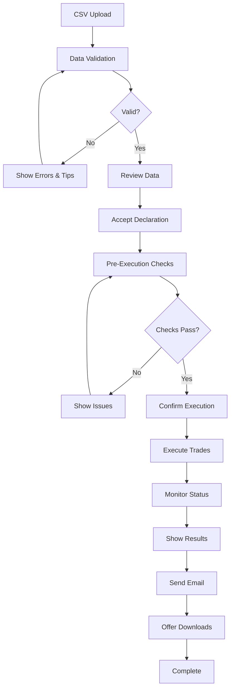

# Enhanced Submit Page Integration Guide

## Complete Integration for Trade Execution Workflow

This guide shows how to integrate the enhanced trade execution components into your existing submit page (`app/pages/3_Declaration_and_Submit.py`).

## Enhanced Submit Page Code

Replace the relevant sections in your submit page with this enhanced implementation:

```python
"""
Review and submission page for Trading Sheet operations with API integration.
Enhanced with comprehensive trade execution UI/UX.
"""

import streamlit as st
import sys
from pathlib import Path
from datetime import datetime
import json

# --- PAGE CONFIG ---
favicon_path = Path(__file__).resolve().parent.parent.parent / "assets" / "logos" / "favicon.png"
st.set_page_config(
    page_title="Review & Submit - Trading Sheet",
    page_icon=str(favicon_path),
    layout="wide",
    initial_sidebar_state="expanded"
)

sys.path.insert(0, str(Path(__file__).resolve().parent.parent.parent))

from app.components.sidebar import render_sidebar
from app.components.submission import handle_submission
from app.components.trade_execution import (
    render_trade_review,
    execute_trades_with_ui,
    render_troubleshooting_panel,
    render_execution_history
)
from app.styling import get_all_styles
from app.utils import initialize_state, persist_checkbox
from app.email_sender import send_trading_submission_email
from app.api.trade_client import TradeAllocationsClient
from app.api.trade_mapper import TradeDataMapper

# Initialize and apply styling
initialize_state()
st.session_state.current_page = "submit"
st.markdown(get_all_styles(), unsafe_allow_html=True)
render_sidebar()

# Hero section
st.markdown("""
<div style="
    background: linear-gradient(135deg, #ed1847 0%, #c41230 100%);
    border-radius: 24px;
    padding: 2.5rem;
    margin-bottom: 2rem;
    box-shadow: 0 20px 40px rgba(237, 24, 71, 0.2);
    position: relative;
    overflow: hidden;
">
    <div style="
        position: absolute;
        top: -30%;
        right: -5%;
        width: 300px;
        height: 300px;
        background: radial-gradient(circle, rgba(237,24,71,0.1) 0%, transparent 70%);
        border-radius: 50%;
    "></div>
    <h1 style="
        color: white;
        font-size: 2.25rem;
        font-weight: 700;
        margin: 0 0 0.75rem 0;
        letter-spacing: -0.02em;
        position: relative;
    ">Review & Execute Trades</h1>
    <p style="
        color: rgba(255, 255, 255, 0.95);
        font-size: 1.125rem;
        margin: 0;
        position: relative;
    ">
        Review your trading data and execute trades through the API
    </p>
</div>
""", unsafe_allow_html=True)

# Check prerequisites
if not st.session_state.get("consent_given", False):
    st.warning("⚠️ Please complete the Declaration step first.")
    if st.button("Go to Declaration"):
        st.switch_page("pages/1_Informed_Consent.py")
    st.stop()

# Check for uploaded data
if 'trading_parser' not in st.session_state:
    st.warning("⚠️ No trading data found. Please upload a CSV file first.")
    if st.button("Go to Upload"):
        st.switch_page("main.py")
    st.stop()

# Get parsed data
parser = st.session_state.get('trading_parser')
parser_data = {
    'data': parser.parsed_data,
    'summary': parser.get_summary_statistics(),
    'validation': parser.get_validation_report(),
    'display_data': parser.format_for_display()
}

# Create tabs for better organization
tab1, tab2, tab3, tab4 = st.tabs([
    "📊 Review Data",
    "🚀 Execute Trades", 
    "📜 History",
    "🔧 Troubleshooting"
])

with tab1:
    st.markdown("### Step 1: Review Trading Data")
    
    # Review the parsed data
    data_valid = render_trade_review(parser_data)
    
    if not data_valid:
        st.error("Please fix the validation errors before proceeding.")
    else:
        st.success("✅ Data is valid and ready for execution")
        
        # Declaration checkbox
        st.markdown("### Step 2: Confirm Declaration")
        
        declaration_col1, declaration_col2 = st.columns([3, 1])
        
        with declaration_col1:
            accept = st.checkbox(
                "I confirm that the trading data is accurate and authorize execution",
                key="accept",
                help="You must accept this declaration before submitting trades"
            )
        
        with declaration_col2:
            if accept:
                st.success("✅ Accepted")
            else:
                st.info("⚠️ Required")

with tab2:
    st.markdown("### Trade Execution")
    
    # Check if data has been reviewed and declaration accepted
    if not st.session_state.get("accept", False):
        st.info("📋 Please review the data and accept the declaration in the 'Review Data' tab first.")
        st.stop()
    
    # Show current environment
    try:
        client = TradeAllocationsClient()
        env_col1, env_col2, env_col3 = st.columns(3)
        
        with env_col1:
            st.info(f"**Environment:** {client.environment.upper()}")
        with env_col2:
            st.info(f"**System ID:** {client.system_id}")
        with env_col3:
            if client.test_connection():
                st.success("**API Status:** ✅ Connected")
            else:
                st.error("**API Status:** ❌ Disconnected")
    except Exception as e:
        st.error(f"Could not initialize API client: {str(e)}")
    
    # Execution button with confirmation
    st.markdown("---")
    
    col1, col2, col3 = st.columns([1, 2, 1])
    
    with col2:
        if st.button(
            "🚀 Execute Trades",
            type="primary",
            use_container_width=True,
            help="Submit trades to the API for execution"
        ):
            # Double confirmation for safety
            st.warning("⚠️ **Final Confirmation**")
            st.write(f"You are about to execute {parser_data['summary']['total_trades']} trades.")
            st.write(f"Total Buy Amount: R {parser_data['summary']['total_buy_amount']:,.2f}")
            st.write(f"Total Sell Amount: R {parser_data['summary']['total_sell_amount']:,.2f}")
            
            confirm_col1, confirm_col2 = st.columns(2)
            
            with confirm_col1:
                if st.button("✅ Confirm & Execute", type="primary", use_container_width=True):
                    
                    # Prepare metadata
                    metadata = {
                        'user_name': st.session_state.get('consent_name', ''),
                        'user_email': st.session_state.get('email', 'trading@example.com'),
                        'timestamp': datetime.now().isoformat(),
                        'declaration_accepted': True,
                        'trader_id': st.session_state.get('trader_id', 45314),
                        'session_id': st.session_state.get('session_id', ''),
                        'environment': client.environment
                    }
                    
                    # Execute trades with enhanced UI
                    success, results = execute_trades_with_ui(
                        parser.parsed_data,
                        metadata
                    )
                    
                    if success:
                        # Store in history
                        if 'trade_execution_history' not in st.session_state:
                            st.session_state['trade_execution_history'] = []
                        
                        st.session_state['trade_execution_history'].append({
                            'timestamp': datetime.now().isoformat(),
                            'group_id': results.get('group_id'),
                            'status': results.get('status'),
                            'trade_count': results.get('trade_count'),
                            'environment': results.get('environment'),
                            'results': results
                        })
                        
                        # Send enhanced email with results
                        st.info("📧 Sending confirmation email...")
                        
                        # Prepare email body with execution results
                        email_body = f"""
                        <html>
                        <body>
                            <h2>Trade Execution Report</h2>
                            <p>Trade execution has been completed.</p>
                            
                            <h3>Execution Summary</h3>
                            <ul>
                                <li><strong>Group ID:</strong> {results.get('group_id')}</li>
                                <li><strong>Status:</strong> {results.get('status')}</li>
                                <li><strong>Environment:</strong> {results.get('environment')}</li>
                                <li><strong>Total Trades:</strong> {results.get('trade_count')}</li>
                                <li><strong>Timestamp:</strong> {results.get('submitted_at')}</li>
                            </ul>
                            
                            <h3>Trade Summary</h3>
                            <ul>
                                <li><strong>Buy Orders:</strong> {parser_data['summary']['buy_trades']}</li>
                                <li><strong>Sell Orders:</strong> {parser_data['summary']['sell_trades']}</li>
                                <li><strong>Total Buy Amount:</strong> R {parser_data['summary']['total_buy_amount']:,.2f}</li>
                                <li><strong>Total Sell Amount:</strong> R {parser_data['summary']['total_sell_amount']:,.2f}</li>
                            </ul>
                            
                            <p>Please find the detailed execution report attached.</p>
                        </body>
                        </html>
                        """
                        
                        # Create enhanced payload for email
                        email_payload = parser.prepare_api_payload(metadata)
                        email_payload['api_execution'] = results
                        
                        email_sent = send_trading_submission_email(
                            recipient_email=metadata['user_email'],
                            subject=f"Trade Execution Report - {results.get('group_id', 'N/A')[:8]}",
                            body=email_body,
                            payload_data=email_payload
                        )
                        
                        if email_sent:
                            st.success("✅ Confirmation email sent successfully")
                        else:
                            st.warning("⚠️ Could not send email, but trades were executed successfully")
                        
                        st.balloons()
                        st.success("🎉 **Trade Execution Complete!**")
                        
                        # Offer to start new batch
                        if st.button("📁 Upload New Trading Sheet"):
                            # Clear relevant session state
                            keys_to_clear = ['trading_parser', 'api_payload', 'trade_group_id']
                            for key in keys_to_clear:
                                if key in st.session_state:
                                    del st.session_state[key]
                            st.switch_page("main.py")
                    
                    else:
                        st.error("❌ Trade execution failed. Please check the error details above.")
            
            with confirm_col2:
                if st.button("❌ Cancel", use_container_width=True):
                    st.info("Trade execution cancelled.")

with tab3:
    st.markdown("### Execution History")
    render_execution_history()

with tab4:
    st.markdown("### Troubleshooting & Support")
    render_troubleshooting_panel()
    
    # Quick actions
    st.markdown("### Quick Actions")
    
    col1, col2, col3 = st.columns(3)
    
    with col1:
        if st.button("🔄 Test API Connection"):
            try:
                client = TradeAllocationsClient()
                if client.test_connection():
                    st.success("✅ API connection successful")
                else:
                    st.error("❌ API connection failed")
            except Exception as e:
                st.error(f"Error: {str(e)}")
    
    with col2:
        if st.button("📥 Download Current Payload"):
            if 'api_payload' in st.session_state:
                st.download_button(
                    label="Download JSON",
                    data=json.dumps(st.session_state['api_payload'], indent=2),
                    file_name=f"api_payload_{datetime.now():%Y%m%d_%H%M%S}.json",
                    mime="application/json"
                )
            else:
                st.info("No payload available yet")
    
    with col3:
        if st.button("🗑️ Clear Session"):
            for key in list(st.session_state.keys()):
                del st.session_state[key]
            st.success("Session cleared")
            st.rerun()

# Footer with status
st.markdown("---")
footer_col1, footer_col2, footer_col3 = st.columns(3)

with footer_col1:
    if 'trade_group_id' in st.session_state:
        st.info(f"Last Group: {st.session_state['trade_group_id'][:8]}...")

with footer_col2:
    if 'trade_execution_results' in st.session_state:
        status = st.session_state['trade_execution_results'].get('status', 'Unknown')
        if status in ['COMPLETED', 'SUCCESS']:
            st.success(f"Status: {status}")
        else:
            st.warning(f"Status: {status}")

with footer_col3:
    st.info(f"Session: {datetime.now():%H:%M}")
```

## Key Enhancements

### 1. **Visual Feedback Throughout Process**
- Progress bars during execution
- Real-time status updates
- Color-coded validation results
- Clear success/error messages

### 2. **Comprehensive Error Handling**
- Detailed error messages with context
- Troubleshooting tips for common issues
- Technical details for support
- Downloadable error reports

### 3. **Pre-Execution Checks**
- API connection verification
- Environment confirmation
- Credentials validation
- System ID verification

### 4. **Enhanced Trade Review**
- Summary metrics dashboard
- Color-coded buy/sell orders
- Trade distribution visualization
- Validation warnings display

### 5. **Execution History**
- Session-based tracking
- Downloadable history reports
- Quick status overview

### 6. **Troubleshooting Support**
- Built-in troubleshooting guide
- Debug information display
- Configuration viewer
- Support contact information

### 7. **Safety Features**
- Double confirmation for execution
- Declaration requirement
- Data validation before submission
- Clear warning messages

### 8. **Post-Execution Features**
- Download execution reports
- Email confirmation with results
- Option to start new batch
- Session management

## UI/UX Flow



## Testing the Enhanced UI

1. **Test with Valid Data:**
   - Upload a properly formatted CSV
   - Verify all metrics display correctly
   - Check that validation passes

2. **Test Error Scenarios:**
   - Upload CSV with missing columns
   - Test with invalid Direction values
   - Try with negative amounts

3. **Test API Integration:**
   - Verify connection status display
   - Test with different environments
   - Check error handling for API failures

4. **Test User Flow:**
   - Complete end-to-end execution
   - Verify email confirmation
   - Check download functionality

## Benefits of Enhanced Solution

1. **User Confidence**: Clear visual feedback at every step
2. **Error Recovery**: Comprehensive troubleshooting support
3. **Audit Trail**: Complete execution history and reports
4. **Professional UI**: Modern, intuitive interface
5. **Safety**: Multiple confirmation steps prevent mistakes
6. **Support**: Built-in help and debugging tools

---

*Enhanced Integration Guide Version: 1.0*  
*Optimized for Trade Execution Workflow*
