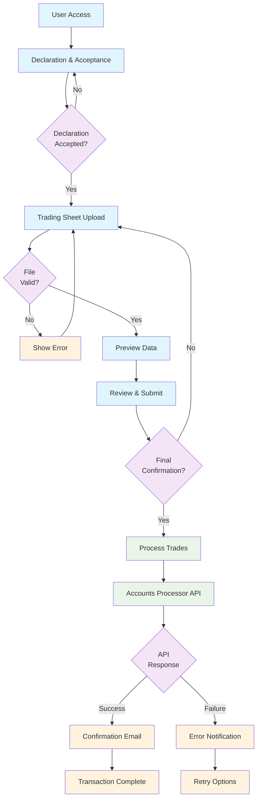
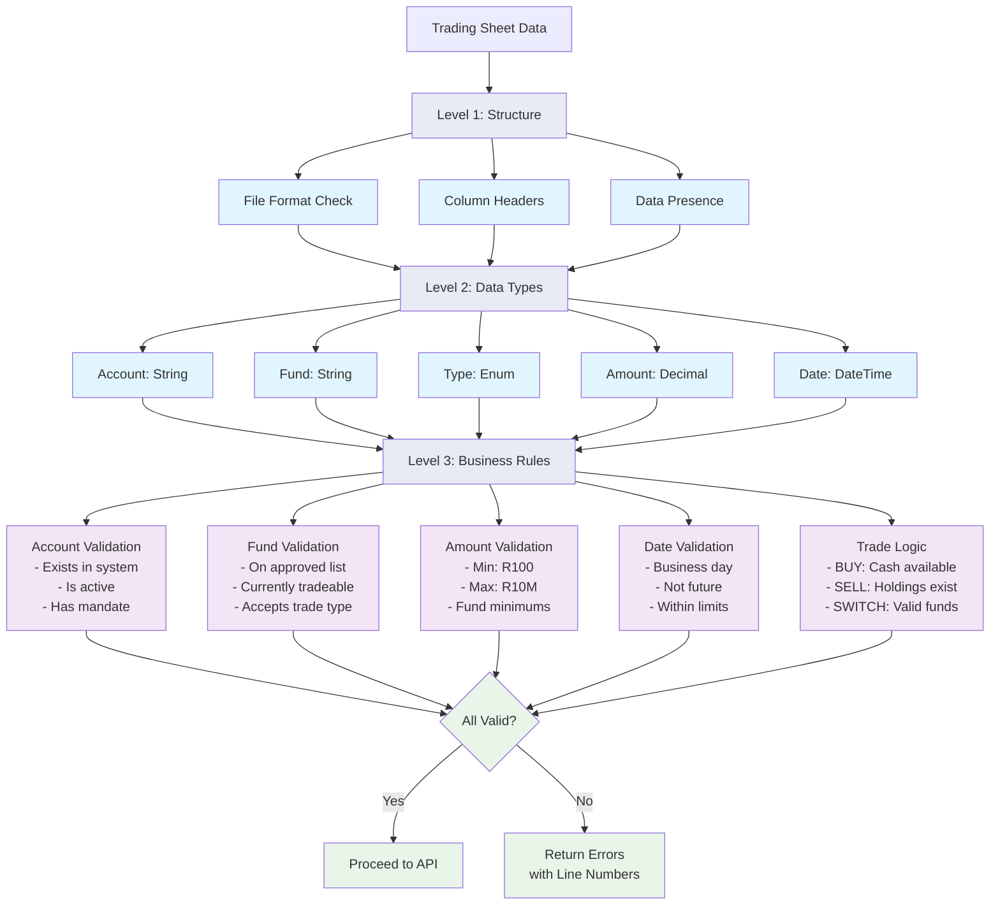
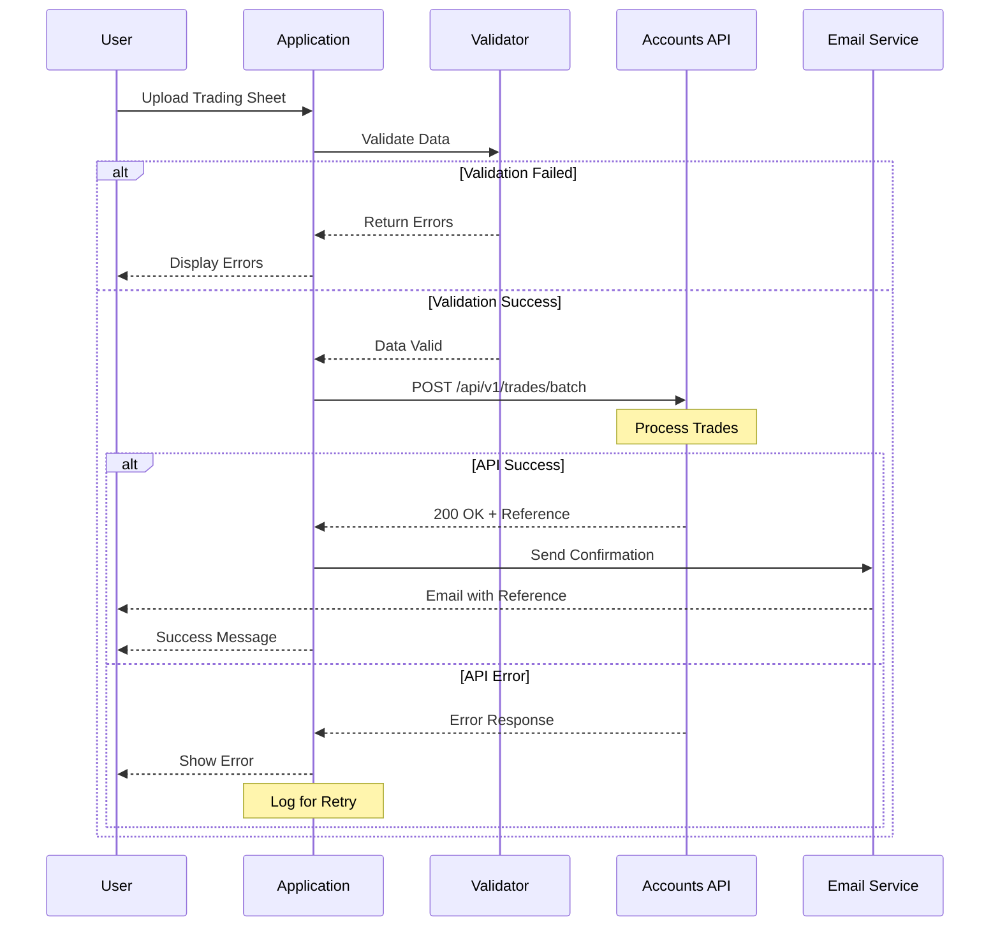
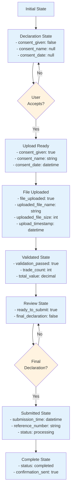
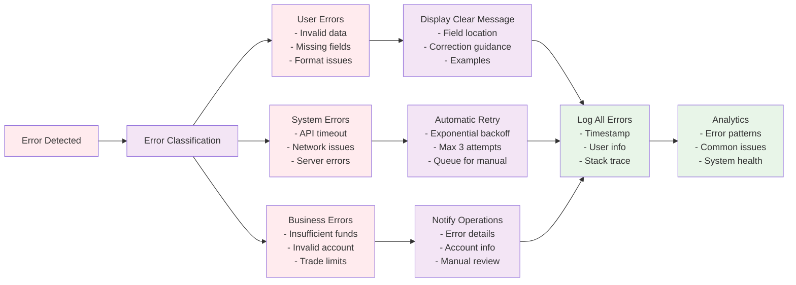
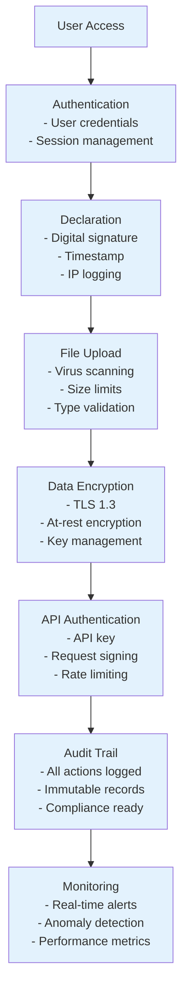

# Trading Sheet Upload System - Flow Diagrams

## System Overview

## Data Processing Pipeline

```mermaid
graph LR
    %% File Processing
    FILE[Excel/CSV File] --> PARSE[File Parser]
    
    PARSE --> EXTRACT[Data Extraction<br/>- Account Numbers<br/>- Fund Codes<br/>- Trade Types<br/>- Amounts<br/>- Dates]
    
    EXTRACT --> VAL1[Format Validation<br/>- Column presence<br/>- Data types<br/>- Required fields]
    
    VAL1 --> VAL2[Business Validation<br/>- Account exists<br/>- Fund approved<br/>- Amount limits<br/>- Date rules]
    
    VAL2 --> TRANSFORM[Transform to API Format<br/>- JSON payload<br/>- Batch structure<br/>- Authentication]
    
    TRANSFORM --> BATCH[Batch Optimizer<br/>- Group trades<br/>- Order execution<br/>- Priority sorting]
    
    BATCH --> SUBMIT[API Submission<br/>- HTTPS POST<br/>- Retry logic<br/>- Error handling]
    
    SUBMIT --> RESULT[Process Response<br/>- Success codes<br/>- Error messages<br/>- Reference numbers]
    
    %% Styling
    classDef input fill:#e3f2fd
    classDef process fill:#f1f8e9
    classDef validation fill:#fff8e1
    classDef output fill:#fce4ec
    
    class FILE input
    class PARSE,EXTRACT,TRANSFORM,BATCH process
    class VAL1,VAL2 validation
    class SUBMIT,RESULT output
```

## Validation Architecture

## API Integration Flow

## State Management

## Error Handling Strategy

## Security Architecture

## Key Architecture Benefits

### 🎯 **Streamlined Workflow**
- Linear progression with clear checkpoints
- Validation at each step prevents downstream errors
- User-friendly error messages guide corrections

### 🔒 **Security First**
- Declaration provides legal accountability
- Encrypted data transmission
- Complete audit trail for compliance

### ⚡ **Performance Optimized**
- Batch processing reduces API calls
- Client-side validation reduces server load
- Async processing for large files

### 📊 **Operational Excellence**
- Comprehensive error handling
- Automated retry mechanisms
- Detailed logging for troubleshooting

This architecture ensures reliable, secure, and efficient processing of Unit Trust trades through the EasyEquities Accounts Processor API.
